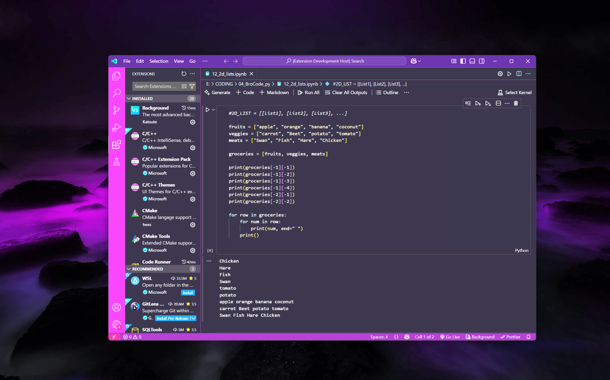

# 👑 MonRch-Darc Theme

MonRch-Darc is a sophisticated and modern Visual Studio Code theme designed to elevate your coding experience with its unique blend of **dark violet backgrounds**, **transparent effects**, and **striking, luxurious colors**. This theme creates a **regal atmosphere** while ensuring **optimal readability** and **aesthetic brilliance**. 🖤💜

---

## 🌌 Demo Pic

---

## ✨ Features

- 🧿 **Dark Violet Background**: A sleek, dark violet backdrop with transparency for a futuristic vibe.
- 🎨 **Rich Color Palette**: Carefully chosen colors that balance **contrast** and **readability**, making your code pop.
- 🧘 **Minimalist Design**: A clean and uncluttered interface to keep the **focus on your code**.
- 🛠️ **Customizable**: Easily tweak and adapt the theme to your **personal style**.

---

## 🎨 Color Palette

### 🖥️ Editor Colors  
- **🖤 Editor Background**: Dark violet with transparency (`#1e1b29CC`)  
- **💚 Editor Foreground**: Mint Green (`#ADEBB3`)  

### 🧑‍💻 Interface Elements  
- **🏰 Title Bar Background**: Dark violet for consistency (`#1e1b29CC`)  
- **👑 Title Bar Active Foreground**: Gold for a royal touch (`#FFD700`)  
- **⚜️ Title Bar Inactive Foreground**: Platinum-like silver (`#B0BEC5`)  
- **📂 Activity Bar Background**: Dark violet (`#1e1b29CC`)  
- **💎 Activity Bar Badge Background**: Dark red with transparency (`#C2185BCC`)  
- **🪄 Side Bar Background**: Dark violet for a cohesive look (`#1e1b29CC`)  
- **🌸 Side Bar Title Foreground**: Light lavender (`#D1C4E9`)  
- **💜 Status Bar Background**: Modern purple (`#8e24aa`)  
- **⚪ Status Bar Foreground**: Crisp white (`#FAFAFA`)  
- **🌟 Editor Group Border**: Royal purple border (`#8e24aa`)  
- **🔲 Side Bar Border**: Matching purple for cohesion (`#8e24aa`)  

---

## 📝 Token Colors  
- **💬 Comments**: Soft grey-blue, italic (`#B0BEC5`)  
- **🌿 Variables**: Soft green (`#C3E88D`)  
- **❌ Invalid/Errors**: Neon red for high contrast (`#ff1744`)  
- **🔮 Keywords**: Vivid purple (`#B388FF`)  
- **💧 Operators & Miscellaneous**: Cyan blue (`#80DEEA`)  
- **🍑 Functions & Special Methods**: Peach tone (`#FFAB91`)  
- **🧡 Strings, Symbols & Headings**: Warm orange (`#FFD180`)  
- **🔥 Classes & Supports**: Bright red-orange (`#FF8A80`)  
- **🌸 Attributes**: Light coral (`#FFAB91`)  
- **🎀 CSS IDs**: Vivid purple-pink (`#E040FB`)  

---

## 🚀 Hope You Love It! 🖤😁
